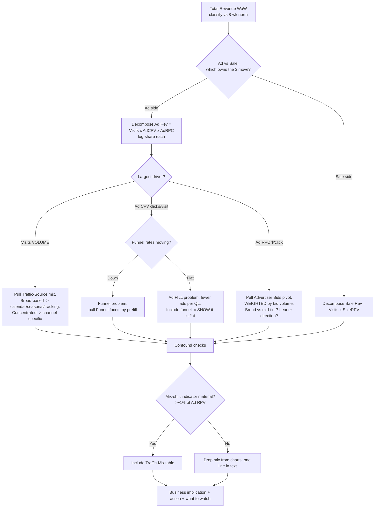

# Marketplace Monitoring — Report Interpretation & Curation Framework

**Owner:** Annie (Data) · **Consumers:** the weekly reasoning/generation step, and Annie each Monday
**Purpose:** Turn scraped weekly metrics into an analysis that reads like a sharp human analyst wrote it — interpret *why* metrics moved, select only the charts that explain *this* week's story, and write a week-distinct executive summary. This is a spec to execute, not an essay. Examples use Auto; the logic is vertical-agnostic.

---

## Part A — The Reusable Framework

### A1. The revenue decomposition backbone (start here every week)

Attribute the headline move to its arithmetic drivers. Two identities do almost all the work:

```
Total Revenue = Ad Revenue + Sale Revenue          (additive: which side moved the $?)

Ad Revenue    = Visits × Ad CPV × Ad RPC           (multiplicative: why did the ad side move?)
                         └ clicks/visit  └ $/click
Sale Revenue  = Visits × Sale RPV                   (multiplicative: why did the sale side move?)
```

> **Metric note (non-obvious): `Ad CPV` = ad Clicks Per Visit, not cost.** It's the funnel/fill lever (paid clicks generated per visit). `Ad RPC` = revenue per ad click — the price/demand lever. Confirm each week: `Ad CPV × Ad RPC ≈ Ad RPV`.

**Attributing a % change to multiplicative drivers (log-share method):** for `Ad Revenue = A × B × C`, each factor's share of the move = `ln(factor_ratio) / ln(total_ratio)`; shares sum to ~100% and tell you which driver *owns* the story. Report as "Visits accounted for ~X% of the ad-revenue change." This step is what separates "revenue fell because clicks fell" (describe) from "revenue fell because we lost traffic, not because clicks got cheaper" (interpret).

### A2. Diagnostic decision tree (top-level outcome → driver → chart)



**Branch cheat-sheet:**

| Dominant driver | It means | Pull this chart | Reads as |
|---|---|---|---|
| **Visits** | Volume / acquisition | Traffic-Source mix | Broad-based across sources → systemic (calendar, seasonality, tracking). Concentrated → one channel broke. |
| **Ad CPV** + funnel **down** | Conversion / traffic quality | Funnel facets by prefill | Users engaging less; check prefill split for quality vs product. |
| **Ad CPV** + funnel **flat** | Ad fill / density | Funnel (to prove it's flat) + fill metric if available | Fewer ads served/filled per quote list — a supply/demand fill signal, not a UX problem. |
| **Ad RPC** | Price / advertiser demand | Advertiser Bids (volume-weighted) | Weight by # bids — the giant advertiser moves the blended number. Isolate broad pullback vs a few carriers. |
| **Sale RPV** | Close rate / premium / carrier mix | Sale tiles (limited chart support — see Part C) | Note direction; flag if it diverges from the ad side. |

### A3. Anomaly detection (is this move real, or noise?)

Never rate severity from WoW% alone. Compare current WoW% to the **trailing 8-week distribution** of WoW%:
- Robust center + spread: **median** and **MAD** (preferred over mean/SD — resists one prior outlier week). `z = (WoW − median) / (1.4826 × MAD)`.
- Classify: `|z| < 1` → **within normal range** · `1 ≤ |z| < 2` → **notable** · `|z| ≥ 2` → **anomaly**.
- Do it on both the **WoW%** and the **level** (value vs the 8-wk band).

This classification drives everything downstream: a "within-normal" section is a candidate to drop and demote; an "anomaly" must be featured even if it's not the biggest $ driver.

### A4. Chart relevance ranking & ordering

**Selection — score each candidate, keep top 3–5:**
```
relevance = contribution_share × anomaly_weight × actionability
```
- **contribution_share** — share of the headline $ move (from A1). A driver worth <10% rarely earns a chart.
- **anomaly_weight** — from A3. A big-but-normal move is less newsworthy than a smaller anomalous one.
- **actionability** — can a stakeholder act (channel pacing, bid outreach) vs exogenous (calendar)?

**Drop rules:**
- Drop any section that is **flat AND within-norm AND not needed to complete the narrative** (revisit rate on a quiet week; the mix-shift indicator at ±0.4%).
- **Exception — the "diagnostic flat" chart:** keep a flat chart when its *flatness resolves an ambiguity* (a flat funnel proves an Ad CPV decline is fill-side, not conversion-side). Say so in the caption.

**Ordering — follow the drill-down, bad news before good:**
1. **Outcome** (revenue bridge/decomposition) → 2. **Primary driver** → 3. **Secondary driver / confound-check** → 4. **Demand/supply detail** (bids or fill) → 5. **Counterpoint / bright spot**, last.

**Per-vertical independence (Auto vs Home):** same week ≠ same report. Auto and Home have completely different numbers and usually different stories, so interpret and curate them **separately** — never mirror one vertical's chart selection, order, count, or color-highlights onto the other. Each vertical's charts come only from its own decomposition and anomalies; divergence is expected (different lead chart, a different number of diagnostics, one dropping the funnel while the other features it, different greyed tiles). Note the structural differences too: for Home the sale side is a negligible base (don't feature it), and the QL cell errors.

### A5. Executive-summary guidance (make it week-distinct)

Four sentences, each earning its place; lead with what's genuinely distinct about THIS week.
1. **Headline** — the outcome with magnitude (and anomaly status once norms are available). State it, don't editorialize it.
2. **Mechanism (numbers)** — the decomposition: volume vs monetization, and (if monetization) fill vs price. Use the log-shares. This is factual attribution, not a verdict.
3. **Nuance / where the signal is** — the clarifying detail a template would miss (broad-based decline; leader bidding up; a divergence), stated as an observation.
4. **Pointer, not a conclusion** — direct the reader to the sections that explain the drivers so *they* can weigh it. Do **not** land on a cause ("this is seasonal"), a verdict ("not a demand collapse"), or a recommendation ("revisit pacing").

**Rules (per Steve, 2026-08-10):** report numbers + a little interpretation; **guide the reader's analysis, don't conclude it** — conclusions are the stakeholders' to draw · bad news first, bright spot last · **Week-distinct test:** *Could this paragraph have been written last week with numbers swapped?* If yes, rewrite · name mechanisms/carriers/sources specifically and quantify the share · **avoid** tile-listing, tautologies, firm causal verdicts, recommendations/action items, and rating a move without checking the 8-wk norm.

### A6. Chart category taxonomy + caption standard

| Category | Contents |
|---|---|
| **Volume** | Visits, Flow Starts, revenue bridge/decomposition |
| **Monetization** | RPV, Ad RPV, Sale RPV, Ad RPC, Ad CPV |
| **Demand & Bids** | Advertiser bid pivot, Aleads |
| **Traffic Mix** | Source mix, mix-shift indicator |
| **Funnel** | Facets by prefill, revisit rate |

**Every caption is exactly two lines:**
- **What this shows:** — structural, reusable across weeks.
- **Why it matters this week:** — week-specific; cites the actual delta and its role. If this line doesn't change week to week, the chart probably shouldn't be in the report.

---

## Part B — Worked Example: Auto, week ending 2026-05-11

### B1. Diagnosis (how the tree runs)

- **Outcome:** Total Revenue −11.4% to $13.2M (≈ −$1.7M). **Ad Revenue −12.0% (≈ −$1.5M) owns the move** (~85% of total). Sale Revenue only −5.7%.
- **Decompose Ad Revenue** (0.935 × 0.959 × 0.982 = 0.880 ✓):
  - **Visits −6.5% → ~53%** (primary, VOLUME)
  - **Ad CPV −4.1% → ~33%** (clicks/visit — fill)
  - **Ad RPC −1.8% → ~14%** (price — smallest)
- **Volume branch → Traffic mix:** decline is **broad-based** — MediaAlpha −18.0%, Chime −16.5%, other −15.3%, SEM-brand −14.3%, SEO-nonbrand −13.7%, SEM −12.5% all fell; only renuant (+21.4%) and surehits (+3.8%) grew. Broad-based → **systemic/calendar suspect**, and **Mother's Day (Sun May 10) fell in-window**. Verify vs same-week-last-year before calling it structural.
- **Ad CPV branch → funnel:** rates are **flat** on both prefill cuts → the clicks-per-visit decline is **fill-side, not conversion-side**. (Flat funnel is the diagnostic here.)
- **Ad RPC branch → bids:** mixed and modest. The giant **Progressive (1.36M bids) raised bids +2.8%**; State Farm +12.0%, USAA +7.8% up; only mid-tier cut (Allstate −7.5%, The General −9.2%, AAA −11.2%, Bristol West −5.9%, Liberty Mutual −3.6%). Net −1.8% → **not a broad demand collapse.**
- **Confound — mix-shift indicator:** +$0.06 / +0.37% → immaterial. Drop from charts; one line in text.
- **Counterpoint:** **Sale RPV +0.9%** — per-visit sale monetization improved; Sale Revenue fell only because visits fell.

**Hypothesis refinement (disagreement protocol):** the brief framed this as co-equal "volume AND weaker monetization … demand-side softness." The decomposition says it's **primarily volume (~53%)**, with monetization weakness **secondary and concentrated in fill (Ad CPV), not price (Ad RPC)** — and the demand signal is minor/mixed (leader bid up). The headline should be **traffic contraction (likely calendar)**, with advertiser pullback a small mid-tier footnote. *Caveat: this severity read assumes visits exceed the trailing-8-week band; if visits normally swing ±7% WoW, −6.5% is noise and the week is a non-event. Confirm with A3 — data not yet in the feed (Part C).*

### B2. Executive summary (as I'd write it)

> Marketplace revenue fell 11.4% to $13.2M last week, and the story is volume, not price: a broad-based 6.5% drop in visits — down across nearly every paid source at once — accounts for just over half of the $1.5M ad-revenue decline, with the rest coming from fewer ad clicks per visit (Ad CPV −4.1%) rather than cheaper clicks. Ad pricing actually held firm (Ad RPC −1.8%) even as market-leader Progressive raised bids 2.8% and State Farm and USAA bid up sharply, so this is not an advertiser-demand collapse — only a handful of mid-tier carriers (Allstate, The General, AAA) trimmed. Because MediaAlpha (−18%), Chime (−16.5%) and SEM (−12.5%) all fell together in a week that contained Mother's Day weekend, the prime suspect is a seasonal traffic dip rather than a structural loss of demand — worth confirming against the same week last year before acting. The bright spot: per-visit sale monetization improved (Sale RPV +0.9%), so revenue quality is intact — the lever to watch is traffic recovery, and if visits don't rebound next week we should revisit paid-source pacing and check in with the mid-tier carriers that pulled back.

### B3. Ranked chart selection

| # | Chart | Category | Why included |
|---|---|---|---|
| 1 | **Ad Revenue decomposition** (Visits × Ad CPV × Ad RPC waterfall) | Volume/Monetization | THE explanatory chart — shows ~53% volume, reframing the week from monetization to traffic. Build from the KPI tiles; fall back to tiles grouped Volume-vs-Monetization if a waterfall can't render. |
| 2 | **Traffic-Source volume** (WoW clicks/visits by source) | Volume/Traffic Mix | Visits are the #1 driver; shows the drop is broad-based → the calendar signal. |
| 3 | **Funnel facets by prefill** | Funnel | Included *because it's flat* — flatness rules out conversion and proves Ad CPV's decline is fill-side. |
| 4 | **Advertiser bid changes** (volume-weighted) | Demand & Bids | RPC is smallest; chart to show demand didn't broadly retreat (leader bid up) and isolate the mid-tier pullback. |
| 5 | **Sale RPV** (WoW) | Monetization | Counterpoint — per-visit sale monetization rose; quality intact once traffic returns. Good news, last. |

**Dropped:** revisit rate (not part of the story); mix-shift indicator (+0.37%, immaterial — one line in text).

### B4. Captions

1. **Ad Revenue decomposition** — *What:* the WoW change in ad revenue split into its three multiplicative drivers (visits, ad clicks per visit, revenue per ad click). *Why this week:* visits explain ~53% of the −12% drop and price only ~14% — the fact that makes this a traffic week, not a monetization week.
2. **Traffic-Source volume** — *What:* prior-vs-current-week ad clicks (and visits) per source. *Why this week:* nearly every source fell together (MediaAlpha −18%, Chime −16.5%, SEM −12.5%), pointing to a systemic/calendar cause, not one channel breaking.
3. **Funnel facets by prefill** — *What:* visits, flow-start rate, and flow-start→quote-list rate, split by prefill. *Why this week:* conversion rates are flat, ruling out the funnel and confirming the click decline is upstream and fill-side.
4. **Advertiser bid changes (volume-weighted)** — *What:* each advertiser's average bid, prior vs current, weighted by # bids. *Why this week:* moves are mixed and the largest bidder (Progressive) raised bids +2.8% — demand didn't broadly retreat; softness is isolated to a few mid-tier carriers.
5. **Sale RPV** — *What:* per-visit sale revenue, WoW. *Why this week:* sale monetization improved (+0.9%) while ad revenue fell — per-visit revenue quality is intact once traffic recovers.

---

## Part C — Data gaps to capture (flagged by Annie)

The framework depends on inputs not in the current scrape list. In priority order:
1. **Trailing 8-week norms per KPI (median + MAD of WoW%, and the level band).** *Required* for A3 — without it we can't tell −6.5% visits from noise, and every severity call is a guess. Highest-value addition.
2. **Same-week-prior-year (YoY) for outcome metrics + visits.** WoW alone can't separate seasonality/calendar (Mother's Day) from structural change.
3. **A calendar/holiday flag in the JSON.** Cheap to add, high diagnostic value for the broad-based-drop pattern.
4. **Ad fill / ads-served (or filled) per quote-list.** We inferred the Ad CPV decline is "fill-side" by elimination; a direct fill metric would confirm.
5. **Realized spend / win-rate / clearing price per advertiser** alongside the bid pivot. A *bid* is intent to pay, not realized RPC.
6. **Sale-side chart support** (close rate, premium, carrier mix).
